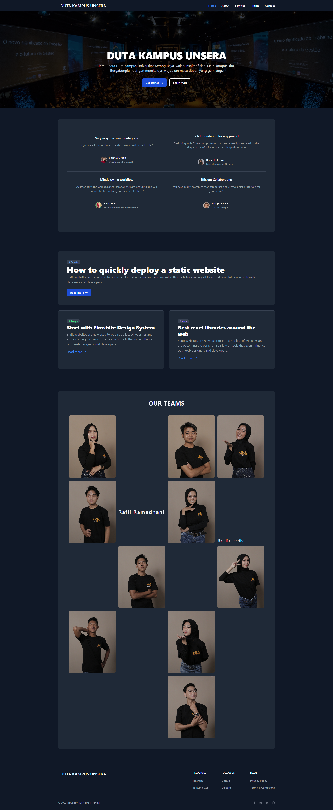

# Website Duta Kampus UNSERA

Ini adalah proyek website yang dibuat menggunakan HTML dan Tailwind CSS. Website ini menampilkan informasi tentang para Duta Kampus Universitas Serang Raya, termasuk wajah-wajah inspiratif dan suara kampus.

## Pratinjau Gambar

Berikut adalah pratinjau beberapa gambar yang ada di folder `/img`:



## Struktur Proyek

- `index.html`: File utama yang berisi struktur HTML dari website.
- `output.css`: File CSS yang dihasilkan oleh Tailwind CSS.

## Fitur

### Jumbotron
Bagian jumbotron menampilkan gambar latar belakang dengan teks yang menarik perhatian pengunjung.

### Testimonial
Bagian ini menampilkan testimoni dari berbagai profesional yang memuji kemudahan integrasi dan efisiensi desain yang menggunakan Tailwind CSS.

### Our Teams
Bagian ini memperkenalkan anggota tim Duta Kampus dengan foto dan tautan ke profil Instagram mereka.

### Footer
Bagian footer menyediakan tautan ke sumber daya, media sosial, dan informasi legal.

## Penggunaan

1. Clone repository ini:
    ```sh
    git clone https://github.com/zendParadox/website-duta-kampus/
    ```
2. Buka file `index.html` di browser untuk melihat website.

## Sumber Daya Tambahan

- [Tailwind CSS](https://tailwindcss.com/): Framework CSS yang digunakan untuk mendesain website ini.
- [Flowbite](https://flowbite.com/): Kumpulan komponen UI yang kompatibel dengan Tailwind CSS.

## Kontribusi

Kontribusi sangat diterima. Silakan buat pull request untuk menambahkan fitur atau memperbaiki bug.

## Lisensi

Proyek ini dilisensikan di bawah lisensi MIT.
